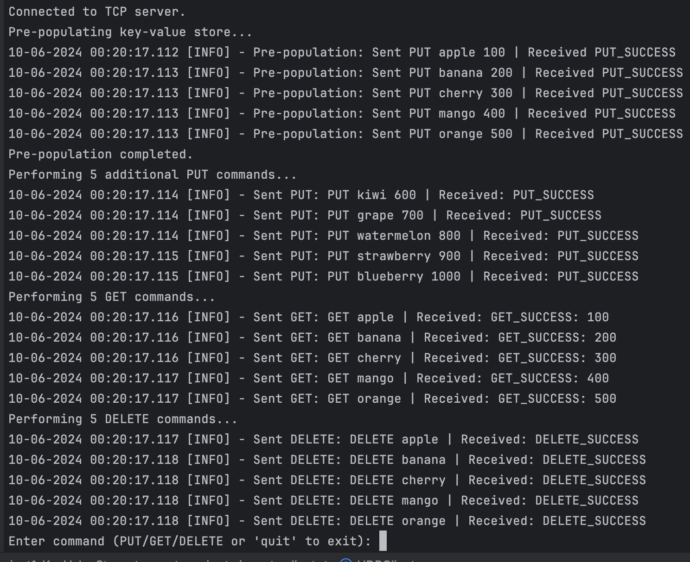
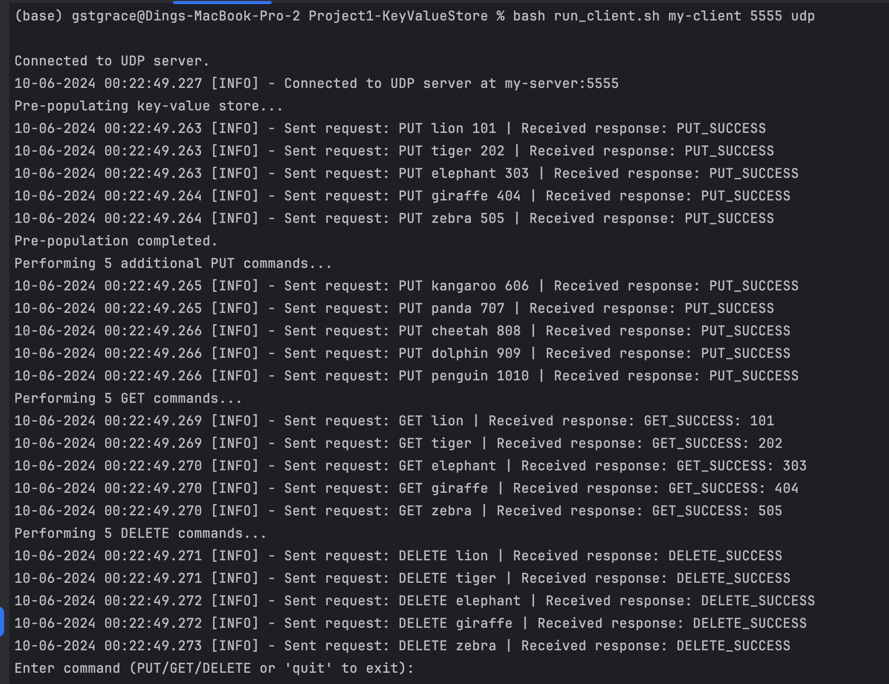

# Project 1 - Single Server Key-Value Store (TCP & UDP)
# Late days left: 4

## Features
- **TCP** and **UDP** communication protocols
- Supports key-value operations:
  - `PUT(key, value)`
  - `GET(key)`
  - `DELETE(key)`
- Pre-populated data explanation:
  - **TCP Dataset**: Fruits with associated attribute numbers 
  - **UDP Dataset**: Animals with associated attribute numbers 

### Setup

1. Open **two terminal windows**—one for the server and one for the client.
2. Navigate to the project directory where the `deploy.sh` and `run_client.sh` scripts are located.

### Usage

Run the server with either TCP(port 1111) or UDP(port 5555):

- **TCP Server:**
  ```bash
  bash deploy.sh my-server tcp

- **TCP Client:**
  ```bash
  bash run_client.sh my-client 1111 tcp

- **UDP Server:**
  ```bash
  bash deploy.sh my-server udp

- **UDP Client:**
  ```bash
  bash run_client.sh my-client 5555 udp

### Shutdown

- **Server**: Press `Ctrl + C` in the server terminal.
- **Client**: Type `quit` to exit.

### Output Demo

- **TCP:**


- **UDP:**


